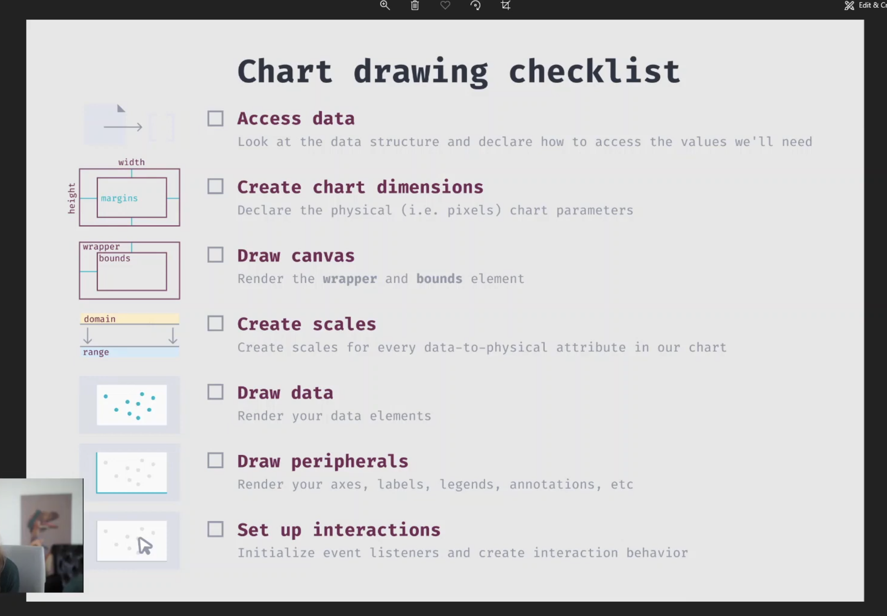

# dugsnotes_d3(en)

##### [한국어 버전은 이 곳을 클릭해주세요](README.md)

##### [日本語バージョンはこちらをクリックして下さい](README_JP.md)

## - Index -

1. Overview
2. Project goal
    
    

### 1. Overview

- Project title : dugsnotes_d3
- Related URL : https://www.udemy.com/course/masteringd3js/
- Period : Aug 20 2025 - in progress
- Member(s) : Dug Park
- Tech stack :  
  
  
  
  
   
   

### 2. Project goal

- Getting used to Javascript data visualization library d3
   
   

### 3. Memo

- flow of d3
  
  <em>source: [Create Custom D3 Charts in Minutes with GitHub Engineer, Amelia Wattenberger
  ](https://youtu.be/S3LNbBg_B2A?si=3yfVMRKi4E77Jd8s)</em>
